# FinAgent CI/CD and Platform Runbook

This repository is the GitOps source of truth for the FinAgent platform.

The main purpose of this runbook is to explain the **delivery pipeline first**:
- what triggers each workflow
- how code moves from a developer PR to a deployed test environment
- how release promotion works
- how Helm repo policy validation protects production-bound changes

Only after the pipeline flow, this document moves into:
- Kubernetes and GitOps structure
- secrets and access control
- domains and dashboards
- verification steps

## 1. What This Repo Is Responsible For

This repo contains:
- Helm charts for application services
- infrastructure charts such as namespaces, gateway, storage, mysql, ollama, and monitoring
- Argo CD environment definitions for `test` and `prod`
- policy validation for Helm changes that are moving toward production

This repo does **not** build application images itself.  
Application images are built in the individual service repositories, and those repos update this Helm repo with the new image tags.

## 2. Delivery Flow Overview

The end-to-end delivery flow is:

1. A developer pushes code to a short-lived branch in a service repository.
2. A pull request is opened.
3. PR validation starts:
   - SonarQube first
   - Snyk second, only if SonarQube passes
4. If the PR is merged to `main`, a second workflow is triggered on PR close.
5. That workflow checks whether the merge is allowed to build:
   - PR merged
   - `build` label present
   - at least one approved review
6. If the gate passes:
   - Docker image is built
   - image is pushed to GHCR with a short SHA tag
   - this Helm repo is updated in the relevant `values-test.yaml`
7. Argo CD sees the new Git change in this repo and syncs the test environment.
8. When a GitHub release is published:
   - the SHA-tagged image is promoted to a semantic version like `v1.0.0`
9. When production-bound Helm changes are proposed:
   - this repo runs Kyverno policy validation for `env/prod` pull requests to `main`

The screenshots in this README are placed in the same order as this flow.

## 3. Pipeline Stage 1: Developer Opens a Pull Request

### Trigger

Trigger:
- `pull_request`
- types: `opened`, `synchronize`

Purpose:
- validate code quality
- stop insecure or low-quality changes before merge
- ensure that only good code reaches the artifact-build stage

### What Happens

When a developer opens a PR:
1. GitHub Actions starts the service repo `ci.yaml`
2. SonarQube runs first
3. If SonarQube passes, Snyk runs next
4. If either fails, notifications are sent and the PR is blocked from progressing cleanly

Why this design is important:
- quality checks happen before build work
- security checks do not waste runtime if code quality already failed
- CI stays cost-aware and governance-focused

Evidence:


## 4. Pipeline Stage 1A: SonarQube Quality Gate

### What SonarQube Does

The SonarQube workflow:
- checks out the repository
- validates the Sonar configuration
- runs the scan
- waits for the quality gate result
- fails the workflow if the quality gate is not passed

Primary secrets used:
- `SONAR_TOKEN`
- `SONAR_HOST_URL`
- `SONAR_PROJECT_KEY`

Why this matters:
- code quality issues are caught before later pipeline stages
- the pipeline has a formal quality gate, not just a build step

Evidence:

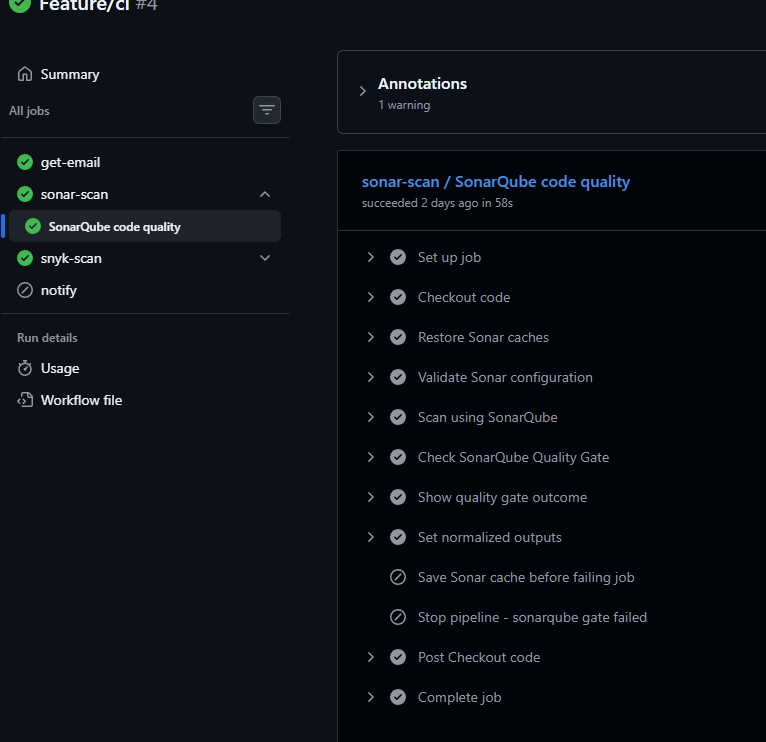


## 5. Pipeline Stage 1B: Snyk Dependency Security Scan

### What Snyk Does

The Snyk workflow:
- installs project dependencies
- scans for dependency vulnerabilities
- authenticates the Snyk CLI
- publishes a project snapshot to the Snyk UI
- blocks the pipeline if high-severity issues are found

Primary secrets used:
- `SNYK_TOKEN`
- `SNYK_ORG`
- `SNYK_PROJECT_ID`

Why this matters:
- dependency risk is checked before merge
- security scanning is integrated into the same PR validation path

Important logic:
- Snyk only runs if SonarQube already passed

Evidence:

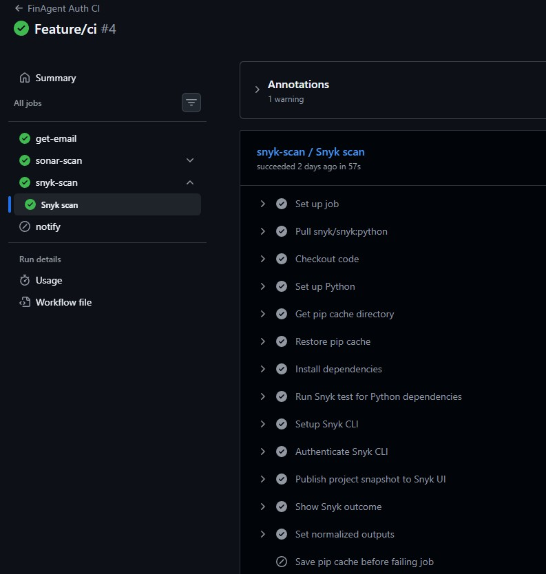

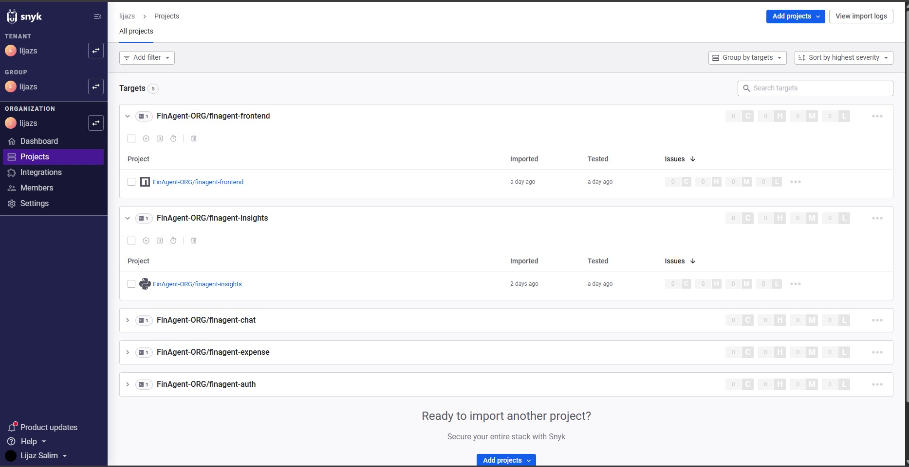

## 6. Pipeline Stage 1C: Failure Notifications

If SonarQube or Snyk fails:
- a reusable notification action sends failure details
- notifications are delivered by email and Slack

Secrets used:
- `SMTP_USERNAME`
- `SMTP_PASSWORD`
- `MAIL_FROM`
- `MAIL_TO`
- `SLACK_INCOMING_WEBHOOK`

Why this matters:
- failures are visible immediately
- the developer or reviewer can act quickly
- the pipeline becomes operationally useful, not just technically correct

Evidence:

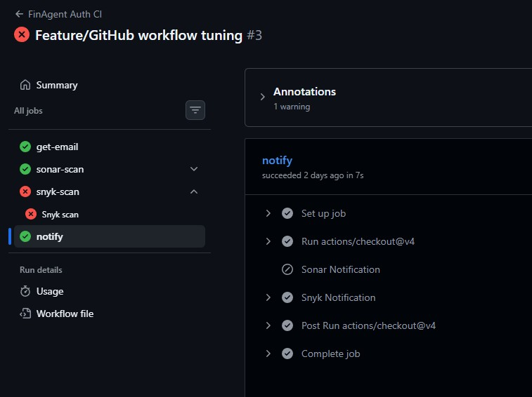

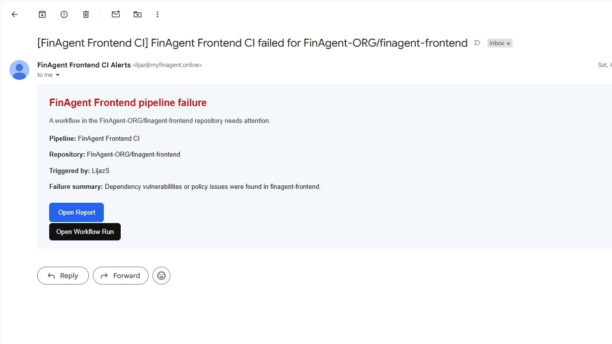


## 7. Pipeline Stage 2: PR Closed After Merge

### Trigger

Trigger:
- `pull_request`
- type: `closed`
- branch: `main`

This does **not** automatically mean an image is built.

### Gate Conditions

The image pipeline only proceeds if:
- the PR was actually merged
- the PR has the `build` label
- at least one review is in the `APPROVED` state

Why this matters:
- not every merged PR should automatically create a deployable artifact
- a manual control point is kept before image creation and test promotion
- governance is built into the pipeline

Evidence:

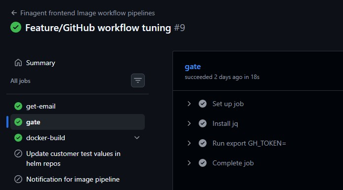

## 8. Pipeline Stage 2A: Docker Build and GHCR Push

If the gate passes:
- the reusable Docker build workflow runs
- image name is resolved from the repo
- a short SHA tag is generated
- the image is built
- the image is pushed to GHCR

Current committed state:
- Docker build is active
- GHCR push is active
- Trivy scan steps exist in the workflow scaffold but are currently commented out in the committed file

Why this matters:
- the pipeline creates immutable build artifacts
- short SHA tags give traceability from code to image

Evidence:

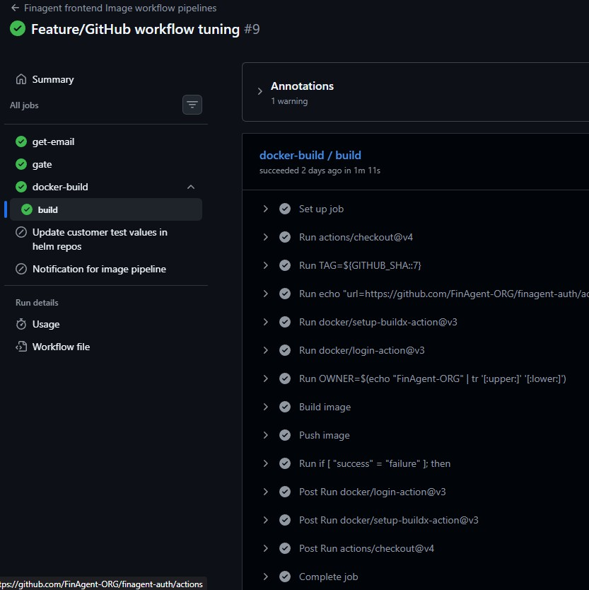


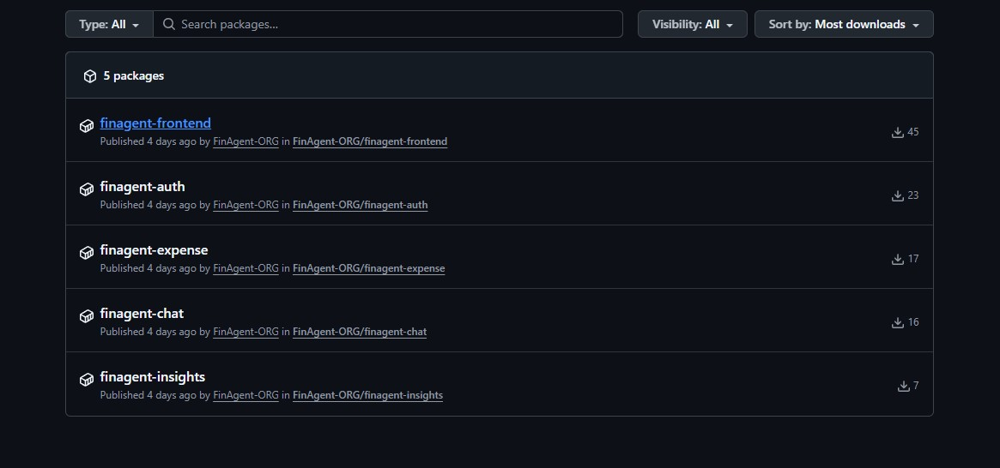

## 9. Pipeline Stage 2B: Helm Repo Update for Test

After a successful image build:
- the service repo calls `update-helm-test.yaml`
- this Helm repo is checked out
- the correct `values-test.yaml` file is updated
- the new image tag is committed and pushed back to this repo

Example:
- auth pipeline updates `apps/test/finagent-auth-service/values-test.yaml`
- the image tag is updated at `.image.tag`

Why this matters:
- Git becomes the deployment trigger
- the CI pipeline does not deploy directly with `kubectl`
- Argo CD picks up the Git change and reconciles the cluster

Evidence:


## 10. Pipeline Stage 3: Release Promotion

### Trigger

Trigger:
- GitHub `release`
- type: `published`

### What Happens

The release workflow:
- validates the semantic version format
- resolves the commit SHA behind the release tag
- pulls the already-built SHA-tagged image
- retags it with a semantic version like `v1.0.0`
- pushes the versioned image back to GHCR

Why this matters:
- CI artifacts stay immutable and traceable
- release tags become human-readable and production-friendly
- production promotion remains deliberate instead of accidental

Evidence:

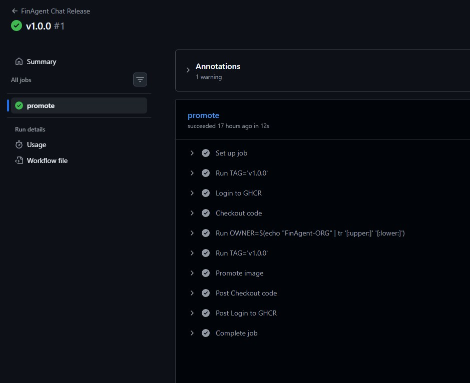


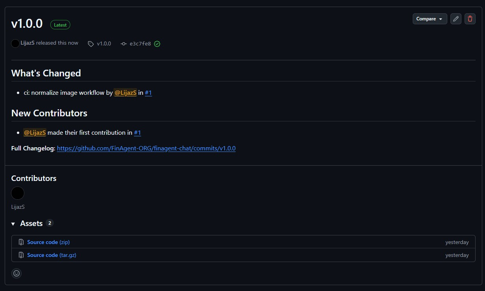

## 11. Pipeline Stage 4: Helm Repo Policy Validation

This repo also has its own CI workflow:
- file: [`.github/workflows/kyverno-lint.yaml`](./.github/workflows/kyverno-lint.yaml)
- trigger: PR `opened` and `synchronize`
- branch target: `main`
- condition: only runs when the source branch is `env/prod`

### What It Does

When a production-bound Helm change is proposed:
1. The PR is opened from `env/prod` to `main`
2. Helm manifests are rendered
3. Kyverno CLI applies policy checks to the rendered output
4. The PR is blocked if the rendered manifests violate policy expectations

Why this matters:
- deployment configuration is validated before it reaches the main GitOps branch
- this adds governance on infrastructure and manifest changes, not only on application code

Evidence:

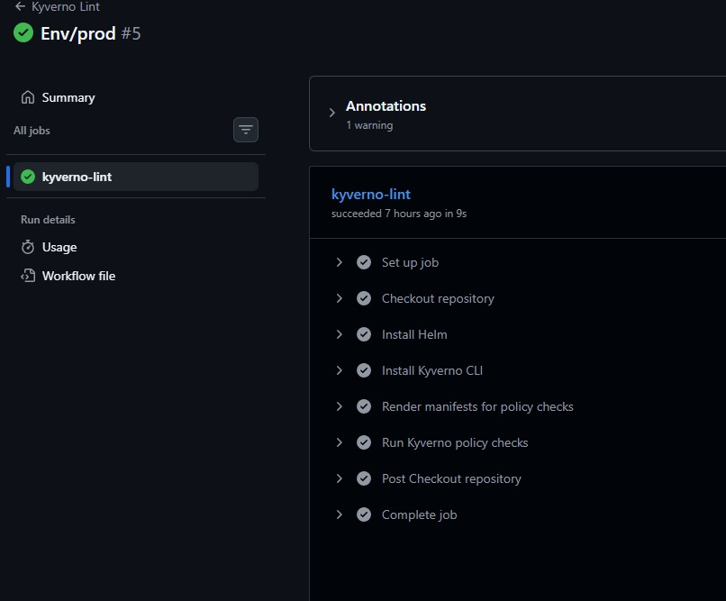


## 12. How the Pipeline Connects to GitOps

This repo is watched by Argo CD using an App-of-Apps structure.

### Root Applications

For each environment there are two root applications:
- `infra-root`
- `apps-root`

Files:
- [`env/test/root/infra-root.yaml`](./env/test/root/infra-root.yaml)
- [`env/test/root/apps-root.yaml`](./env/test/root/apps-root.yaml)
- [`env/prod/root/infra-root.yaml`](./env/prod/root/infra-root.yaml)
- [`env/prod/root/apps-root.yaml`](./env/prod/root/apps-root.yaml)

### Watched Paths

Test:
- `env/test/infra`
- `env/test/apps`

Prod:
- `env/prod/infra`
- `env/prod/apps`

Current sync behavior:
- `targetRevision: main`
- automated sync enabled
- `prune: true`
- `selfHeal: true`

### Why This Is Important

Once a service repo updates `values-test.yaml` here:
- Argo CD sees the Git change
- syncs the affected application
- deploys the new image into the test cluster

So the real deployment handoff is:
- **service repo CI** -> **Helm repo Git change** -> **Argo CD sync**

Evidence:


## 13. Kubernetes and Platform Context

Now that the delivery pipeline is explained, this section provides the Kubernetes context that receives the pipeline output.

### 13.1 Cluster and Network Model

The deployed platform uses:
- a `public subnet` containing the HAProxy edge server
- a `private subnet` containing the Kubernetes cluster
- internal-only service communication through `ClusterIP`
- a shared in-cluster gateway for service routing

### 13.2 Namespace Layout

Namespaces currently defined in [`infra/namespaces/values.yaml`](./infra/namespaces/values.yaml):

| Namespace | Purpose |
|---|---|
| `finagent-apps` | frontend, auth, chat, expense, insights |
| `finagent-dbs` | mysql and ollama |
| `finagent-gateway-ns` | shared gateway resources |
| `keycloak` | OIDC and identity |
| `monitoring` | Prometheus, Grafana, Loki, Promtail |

### 13.3 Storage and AI Runtime

This repo includes:
- NFS-backed dynamic provisioning through [`infra/nfs-storageclass`](./infra/nfs-storageclass)
- MySQL stateful workloads
- Ollama in `finagent-dbs`
- persistent model storage for `llama3.2:3b`
- GPU node targeting for AI inference

### 13.4 Database Access Isolation

The committed MySQL network policy allows access only from:
- `finagent-auth-service`
- `finagent-expense-service`

Source:
- [`infra/mysql/templates/networkpolicy.yaml`](./infra/mysql/templates/networkpolicy.yaml)

Evidence:

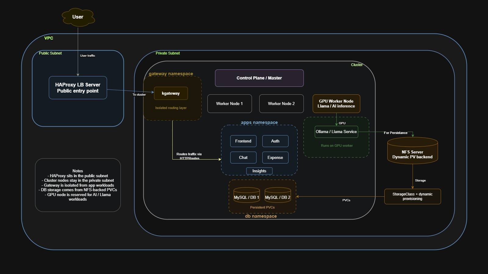


## 14. Secret Management

### 14.1 Runtime Secrets in Kubernetes

Application runtime secrets are stored as `SealedSecret` manifests rather than plain Kubernetes `Secret` YAML in Git.

Examples:
- [`apps/test/finagent-auth-service/templates/sealed-secret.yaml`](./apps/test/finagent-auth-service/templates/sealed-secret.yaml)
- similar files exist for auth, chat, expense, insights, and mysql charts

This gives:
- encrypted secret storage in Git
- cluster-side secret materialization
- safe GitOps compatibility

### 14.2 GitHub Actions Secrets

The pipelines rely on repository or organization secrets such as:

| Secret | Used For |
|---|---|
| `SONAR_TOKEN` | SonarQube authentication |
| `SONAR_HOST_URL` | SonarQube endpoint |
| `SONAR_PROJECT_KEY` | SonarQube project identity |
| `SNYK_TOKEN` | Snyk authentication |
| `SNYK_ORG` | Snyk reporting links |
| `SNYK_PROJECT_ID` | Snyk project reference |
| `HELM_REPO_TOKEN` | updating this Helm repo from app repos |
| `SMTP_USERNAME` / `SMTP_PASSWORD` | email notification delivery |
| `MAIL_FROM` / `MAIL_TO` | notification sender / receiver |
| `SLACK_INCOMING_WEBHOOK` | Slack delivery |
| `GITHUB_TOKEN` | GHCR and workflow repo operations |

### 14.3 Access Governance

Headlamp RBAC definitions in [`infra/headlamp/rbac.yaml`](./infra/headlamp/rbac.yaml) currently include:
- `headlamp-admins` as cluster administrators
- `dev` group scoped to `finagent-apps`
- `db` group scoped to `finagent-dbs`

## 15. Domains and Dashboards

### 15.1 Public Domains Confirmed in This Repo

| Domain | Purpose | Source |
|---|---|---|
| `myfinagent.online` | Frontend UI | [`apps/test/finagent-frontend/values-test.yaml`](./apps/test/finagent-frontend/values-test.yaml) |
| `argocd.myfinagent.online` | Argo CD | [`argo-route.yaml`](./argo-route.yaml) |
| `keycloak.myfinagent.online` | Keycloak | [`env/test/infra/keycloak-route.yaml`](./env/test/infra/keycloak-route.yaml) |
| `k8s.myfinagent.online` | Headlamp | [`infra/headlamp/headlamp-route.yaml`](./infra/headlamp/headlamp-route.yaml) |
| `grafana.myfinagent.online` | Grafana | [`infra/monitoring/prometheus/values.yaml`](./infra/monitoring/prometheus/values.yaml) |

### 15.2 Application UI


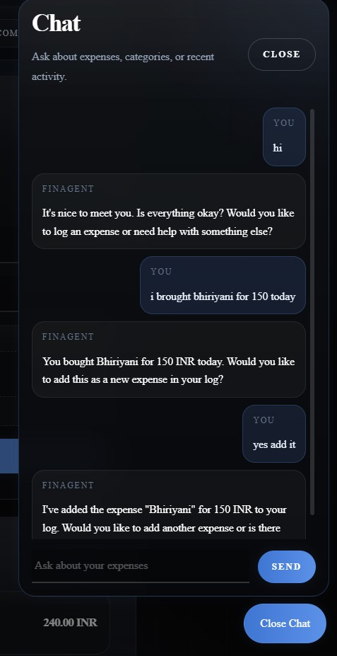

### 15.3 Platform Dashboards


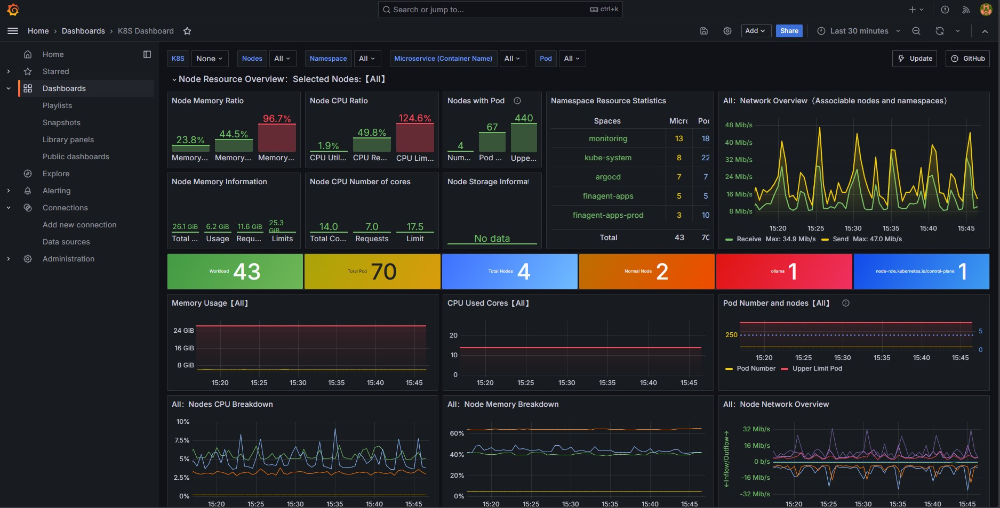

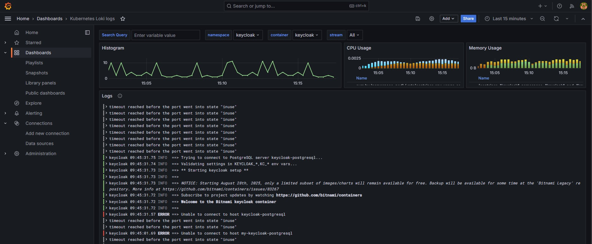

## 16. Verification Runbook

### 16.1 Cluster Health

```bash
kubectl get ns
kubectl get pods -n finagent-apps
kubectl get pods -n finagent-dbs
kubectl get pods -n finagent-gateway-ns
kubectl get pods -n keycloak
kubectl get pods -n monitoring
```

### 16.2 Gateway and Route Checks

```bash
kubectl get gateway -n finagent-gateway-ns
kubectl get httproute -A
kubectl describe gateway finagent-gateway -n finagent-gateway-ns
kubectl describe httproute -n finagent-apps
```

### 16.3 Service, Endpoint, and Storage Checks

```bash
kubectl get svc -n finagent-apps
kubectl get svc -n finagent-dbs
kubectl get endpoints -n finagent-apps
kubectl get endpoints -n finagent-dbs
kubectl get storageclass
kubectl get pvc -n finagent-dbs
kubectl get pvc -n monitoring
```

### 16.4 Secret Checks

```bash
kubectl get sealedsecrets -A
kubectl get secrets -n finagent-apps
kubectl get secrets -n finagent-dbs
```

### 16.5 Full Namespace Resource Checks

```bash
kubectl get all -n finagent-apps
kubectl get all -n finagent-dbs
kubectl get all -n finagent-gateway-ns
kubectl get all -n keycloak
kubectl get all -n monitoring
```

Evidence:


### 16.6 External Domain Checks

```bash
curl -I https://myfinagent.online
curl -I https://argocd.myfinagent.online
curl -I https://keycloak.myfinagent.online
curl -I https://k8s.myfinagent.online
curl -I https://grafana.myfinagent.online
```

### 16.7 Internal Connectivity Checks

```bash
kubectl get deploy -n finagent-apps
kubectl get pods -n finagent-apps
kubectl exec -it <pod-name> -n finagent-apps -- sh
```

Inside a pod or debug container:

```bash
getent hosts expense-service.finagent-apps.svc.cluster.local
getent hosts ollama.finagent-dbs.svc.cluster.local
```

## 17. Quick Review Checklist

1. Confirm PR validation runs in sequence: SonarQube first, Snyk second.
2. Confirm notifications are sent when PR validation fails.
3. Confirm image build only runs after merged PR + `build` label + approval.
4. Confirm successful image pipelines update this repo's `values-test.yaml`.
5. Confirm Argo CD syncs that Git change into the test cluster.
6. Confirm release workflows promote SHA-tagged images into semantic versions.
7. Confirm `env/prod` pull requests to `main` pass Kyverno policy validation.
8. Confirm SealedSecrets are reconciled into runtime Kubernetes secrets.
9. Confirm domains and dashboards are reachable through the platform entry path.
